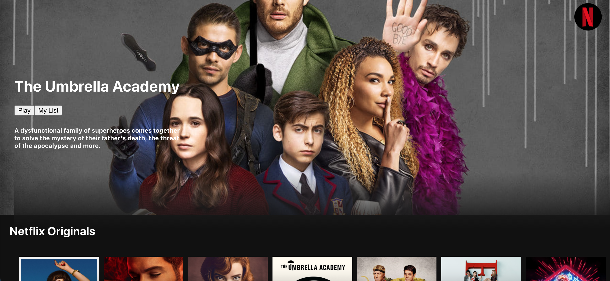
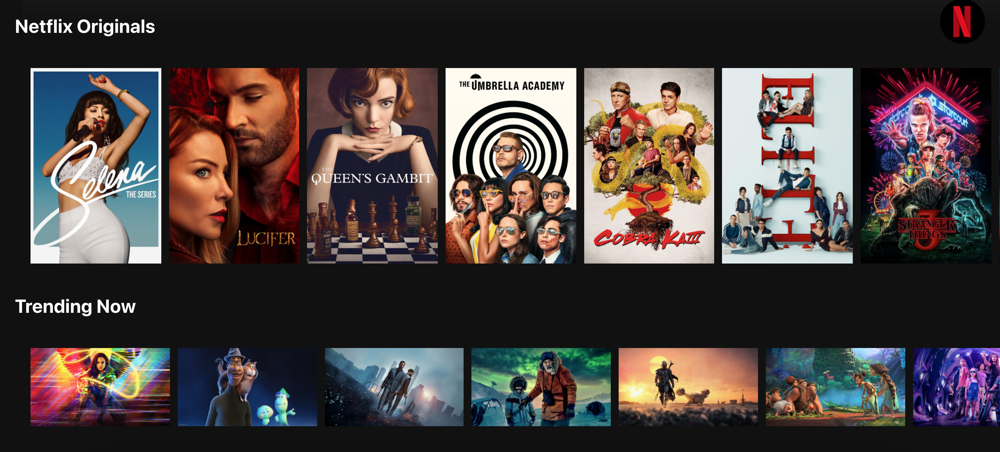
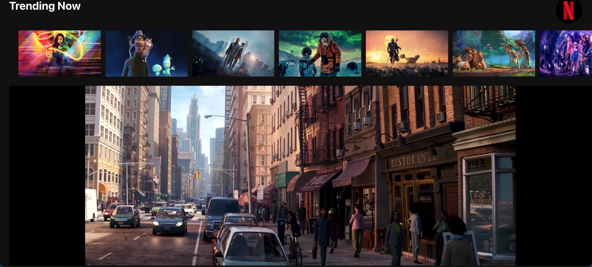

# netflix-comedy-flix

Live site: https://netflix-clone-joy-flix.herokuapp.com/

Comedy flix is a Netflix clone,a user can click see the different miviee, and can click on a moc=vie to watch its trailer. This application consumes a third party API to get movie data, as well as npm packages to get their treilers from YouTube.

# List of Technologies:

- ReactJS.
- Javascript
- RestFul API Services
- Cascading Style Sheets(CSS)
- React Bootstrap
- React YouTube
- npm movie-trailer
- Axios
- React Hooks
- Git

# User stories

- user can click on a poster and watch the trailer of a movie

### Screenshot of the Application

 

 

 

### API'S:

The Movie Database (TMDb) is a popular user editable database for movies and TV shows
